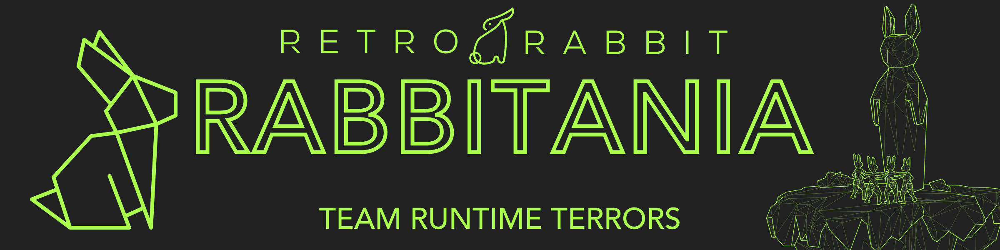

# Rabbitania

 
 

## Project Description

The Covid 19 pandemic brought with it several challenges that almost every business has had to face. One of these major challenges is that companies have been forced to move from an environment where all interactions were in-person, to one where communication had to become digital. Rabbitania will offer a totally digital work environment by offering a collection of tools that will make interactions between colleagues as seamless as it would be if they were sitting directly next to one another.

## Technology Stack

<ul>
    <h4>Back-End:</h4>
    <li></li>
    <h4>Front-End:</h4>
    <li></li>
    <h4>Database:</h4>
    <li></li>
    <h4>Other:</h4>
    <li></li>
</ul>

-----------------------------------------------------------------------------------

## GitHub Structure: 

- [Runtime Terrors Team Members](#Runtime_Terrors_Team_Members)
- [GitHub Management](#GitHub-Management) 💼
- [Documentation](#Documentation) 📉
- [Demo Video Links](#Demo-Video-Links) 🎥
- [Project Management Tools](#project-management-tools) 🧰

-----------------------------------------------------------------------------------

# Team Runtime Terrors
## Team Members

#### Joseph Harraway | u16049943

  

  

                 I am currently a final year BSc ComputerScience student studying at The University of Pretoria.
                 I have a keen interest in everything software and am always willing to add to my knowledge base.
                 The languages I am most proficient at are: Java, C++, and Python. I also have experience using 
                 several web-based programming languages and technologies such as PHP, JavaScript, HTML, CSS, 
                 Java Spring Boot and NodeJS.I am extremely interested in the field of Artificial Intelligence and
                 I am hoping to broaden my expertise in that area throughout this year and into honours.
  

  
-----------------------------------------------------------------------------------

 

#### Matthew Harty | u17005486

  

                I am currently a BSc Information and Knowledge Systems student with a passion for full stack web and 
                mobile software development. Technologies that I am currently interested in and familiar are as follows:
                JavaScript, TypeScript, Node.js, Java, HTML, CSS, PHP, Java, C++ and C# and database technologies such as
                MySQL, PostgreSQL with some MongoDB  experience. I also have an interest in many full stack frameworks
                such as ASP .NET Core, Angular, React, Ionic, Spring Boot.
                    
                I also have a passion for sports such as Water Polo, Golf and many more which make up a lot of my spare
                time along with a healthy social life and plenty ofgetaways to my game farm to decompress.
  

-----------------------------------------------------------------------------------

#### Dean Nortje | u17326622

  

                   
                    I am a final year BSc Information and Knowledge Systems student with a passion for software development.
                    I am a hard-working and strategic individual. I enjoy teamwork but also function well as a leader, eager
                    to take on any responsibility. I have experience with multiple technologies namely Java, C++, C#, Python,
                    ASP.NET, Angular, NodeJS, PHP, Ionic, XML, HTML, CSS, TypeScript, JavaScript, Bootstrap, Spring Boot, SQL,
                    and NoSQL Databases. I have a passion for doing activities such as rock climbing, motocross, and gaming.
                    Other interests of mine include Formula 1 and stock/crypto markets.
  

  
-----------------------------------------------------------------------------------

#### James Hulett | u16003251

  

                   
                   I am a final year BSc Knowledge and Information Sciences student at the University of
                   Pretoria and part time Web Developer at The Kulture Collab. I have experience with 
                   multiple languages/technologies such as Java, C++, C#, ASP.NET, Angular, NodeJS, 
                   JavaScript, NodeJS, Spring, XML, PHP, NoSQL, and SQL databases. I have also completed 
                   networking certificates such as my CCNP R&S certificate. I have a passion for knowledge
                   and enjoy gym, gaming and playing tennis in my spare time.
  

-----------------------------------------------------------------------------------

#### DeVilliers Meiring | u17074292

  

                   
                Currently studying BSc Information and Knowledge Systems. I am hard working as well as eager to 
                learn new technologies. Technologies I have experience with PHP, NodeJS, .NET Core, Java, JavaScript,
                TypeScript, React, Angular, Ionic, C#, C++, XML, HTML, CSS, bootstrap, and Spring Boot for java web 
                applications, as well as experience with database design and experience in both NoSQL as well as 
                SQL database systems.

  

  
-----------------------------------------------------------------------------------

# GitHub-Management

## Monorepo and Git Flow

### Branching Strategy

- master (build)
    - development (build)
        - development_backend
            - backend_subsystem
        - development_frontend
            - frontend_feature

# Documentation

- [Software Requirements Specification - Rabbitania](https://www.overleaf.com/project/60afeae5d667afd0a58d4903)

# Demo-Video-Links

* <a href="https://drive.google.com/file/d/1VzDT_z24Rofzv6nKbINAixBn9qgndyxM/view?usp=sharing"> Demo 1 </a>
* <a href="https://youtu.be/dQw4w9WgXcQ"> Demo 2 </a>
* <a href="https://youtu.be/dQw4w9WgXcQ"> Demo 3 </a>
* <a href="https://youtu.be/dQw4w9WgXcQ"> Demo 4 </a>

---

# Project Management Tools

- :open_book: [Runtime Terrors - Rabbitania Project Board](https://github.com/COS301-SE-2021/Rabbitania/projects/1)
